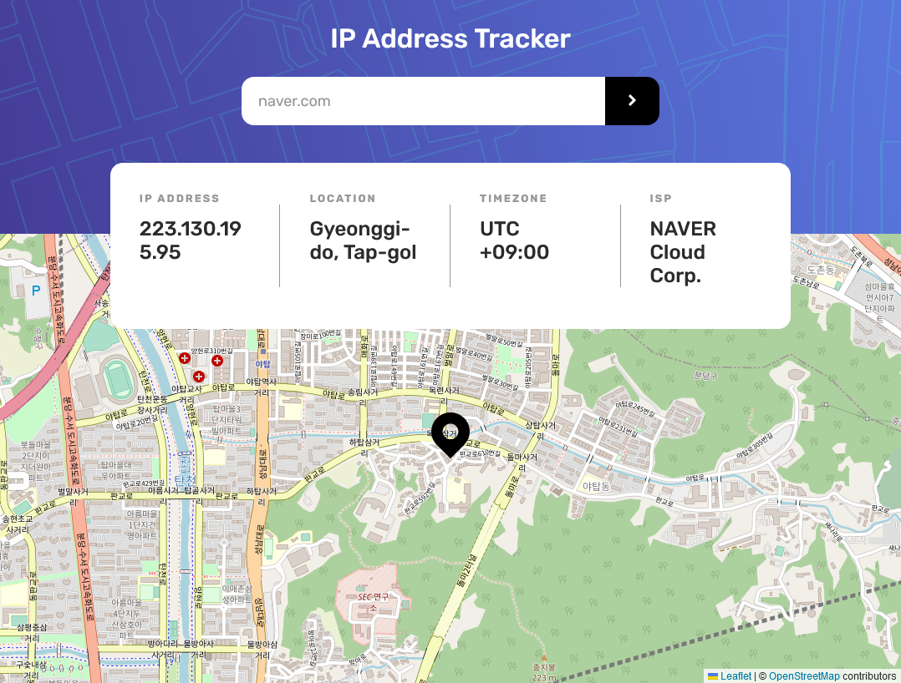

# Frontend Mentor - IP address tracker solution

This is a solution to the [IP address tracker challenge on Frontend Mentor](https://www.frontendmentor.io/challenges/ip-address-tracker-I8-0yYAH0). 

## Table of contents

- [Overview](#overview)
  - [The challenge](#the-challenge)
  - [Screenshot](#screenshot)
  - [Links](#links)
- [My process](#my-process)
  - [Built with](#built-with)
- [Author](#author)

## Overview

### The challenge

Users should be able to:

- View the optimal layout for each page depending on their device's screen size
- See hover states for all interactive elements on the page
- See their own IP address on the map on the initial page load
- Search for any IP addresses or domains and see the key information and location

### Screenshot

### Links

- Solution URL: <https://github.com/pinkserial/ip-address-tracker>
- Live Site URL: <https://pinkserial.github.io/ip-address-tracker>

## My process

### Built with

- Semantic HTML5 markup
- CSS custom properties
- Flexbox
- [React](https://reactjs.org/) - JS library
- [Leaflet](https://leafletjs.com/) - JS library
- [React Leaflet](https://react-leaflet.js.org/) - JS library
- [IP Geolocation API](https://geo.ipify.org) - API
- [Vite](https://vitejs.dev/) - frontend tool

## Author

- Github - [김종민](https://www.github.com/pinkserial)
